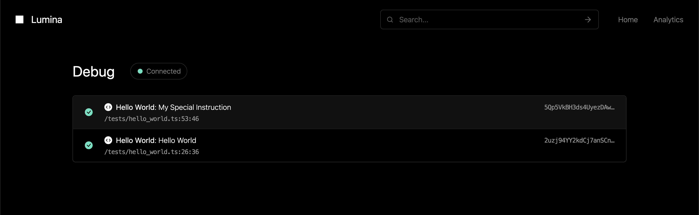

# @lumina-dev/test

A single-line utility for spinning up an interactive [Lumina](https://lumina.fyi) explorer for your [Solana](https://github.com/solana-labs/solana) application tests.

## Installation

```bash
npm install @lumina-dev/test
```

## Usage

Modify your test file to call the `lumina` function exported by this package.

```js
import * as anchor from '@coral-xyz/anchor';
import lumina from '@lumina-dev/test';

// Add this to the top of your test file
lumina();

describe('my-anchor-test', () => {
  anchor.setProvider(anchor.AnchorProvider.env());
  const program = anchor.workspace.MyProgram;
  // ...
});
```

When running your tests, navigate link in the console to view debug info.

```
⬜ Lumina: View local debug info at https://lumina.fyi/debug
```

A new tab will open with an interactive explorer for your local test environment.



## Community

Join the [Lumina Discord](http://discord.gg/e8J6wDwwrq) to chat with the community and team.
